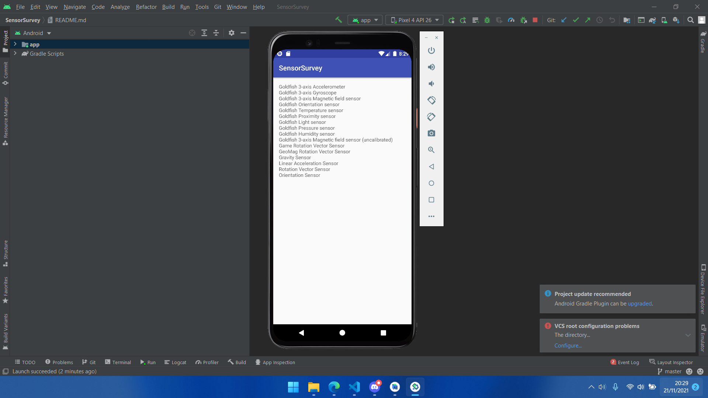
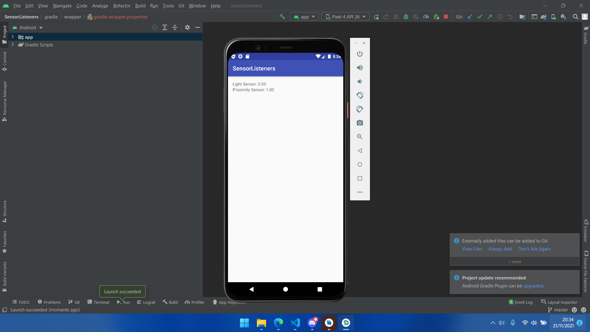
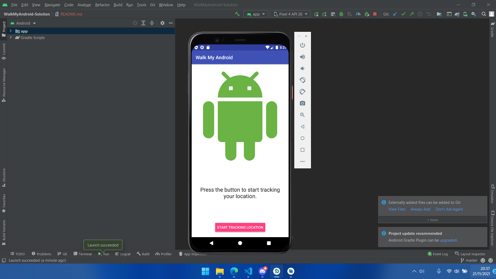
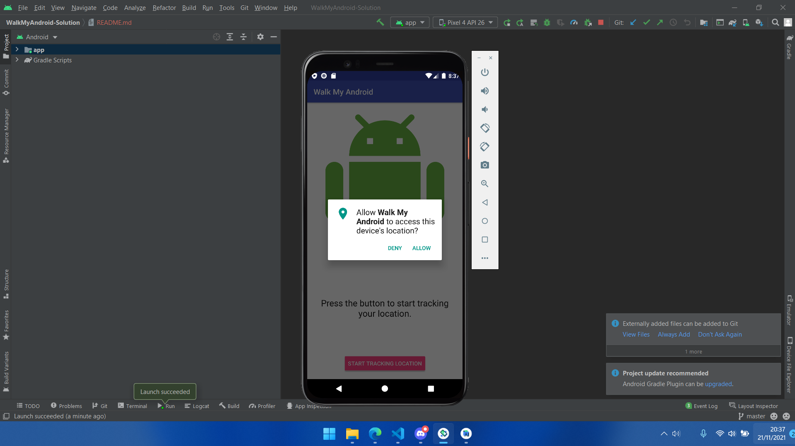
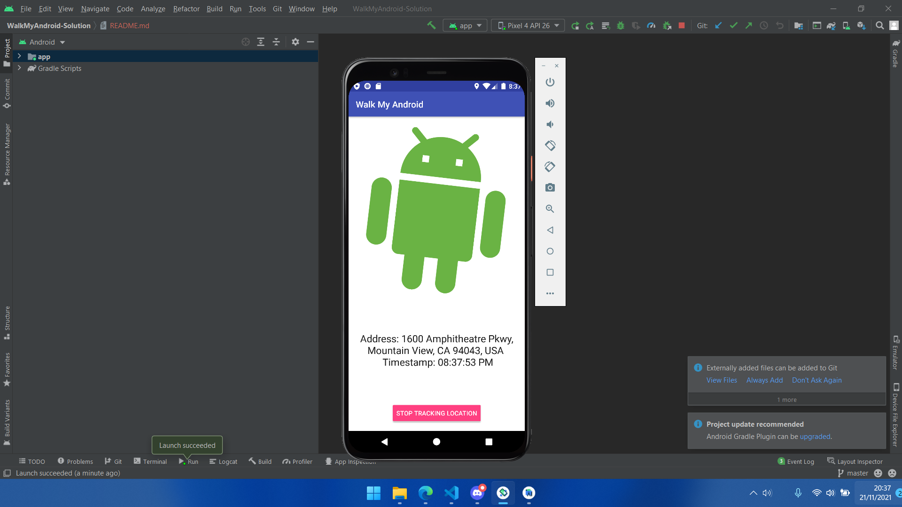

# Jobsheet 11 - LOCATION

## Rangkuman
### Sensor
##### Sensor adalah perangkat yang digunakan untuk memberikan informasi tentang ada tidaknya suatu objek. Sensor Siemens termasuk sakelar batas, fotolistrik, induktif, kapasitif, dan sensor ultrasonik.
#### Categories and types of sensors
1. Accelerometers
2. Gravity sensors 
3. Gyroscopes 
4. Rotational vector sensors

#### The motion and position sensors
Sensor gerak dan posisi di Android biasanya menggunakan dua sistem koordinat yang berbeda: sistem koordinat perangkat relatif terhadap perangkat, dan sistem koordinat relatif terhadap permukaan bumi. Kedua sistem menggunakan sistem 3-sumbu standar ( x , y , z ).

#### Location services
Layanan berbasis lokasi menggunakan geodata real-time dari smartphone untuk memberikan informasi, hiburan, atau keamanan.
Layanan berbasis lokasi mengandalkan smartphone konsumen untuk memberikan peluang interaktif dan iklan bertarget.
Pelacakan lokasi dilakukan dengan data GPS, data Wi-Fi, ping menara seluler, kode QR, dan teknologi RFID.

#### Using the Places API
Places API adalah layanan yang mengembalikan informasi tentang tempat menggunakan permintaan HTTP. Tempat didefinisikan dalam API ini sebagai tempat, lokasi geografis, atau tempat menarik yang menonjol.

Setiap layanan diakses sebagai permintaan HTTP, dan mengembalikan respons JSON atau XML. Semua permintaan ke layanan Places harus menggunakan protokol https://, dan menyertakan kunci API.

Places API menggunakan ID tempat untuk mengidentifikasi tempat secara unik. Untuk detail tentang format dan penggunaan pengenal ini di seluruh Places API dan API lainnya, lihat dokumentasi ID Tempat.

## Hasil Praktikum
Sensor Survey

Sensor Listener

Walk My Android

